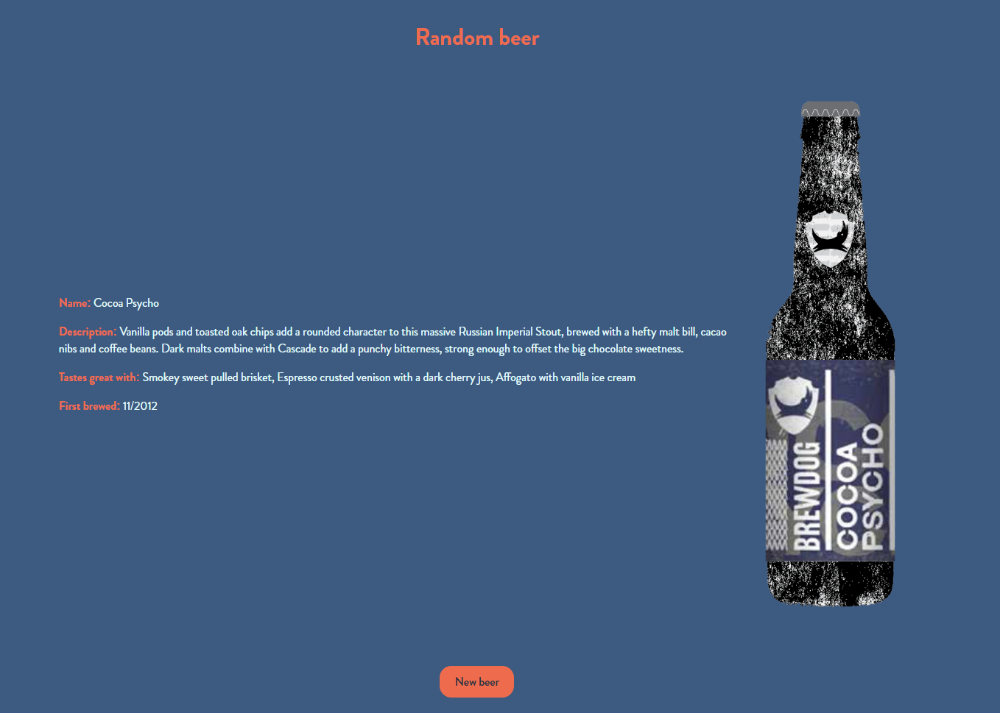

# Beer API

An API exercise done during my free time as a training into the world of APIs.

## The Goal

Using the [Punk API](https://punkapi.com/) to display a random beer from the API and some usefull information about it.

Side Note: *The images provided by the API are not of very good quality at the time of writing.*

## What does it look like ?

Check the result ➡️ [here](https://dystrima.github.io/Beer-API/) ⬅️

